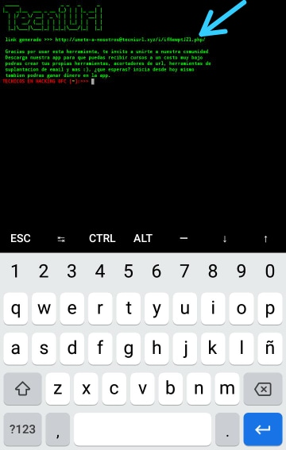
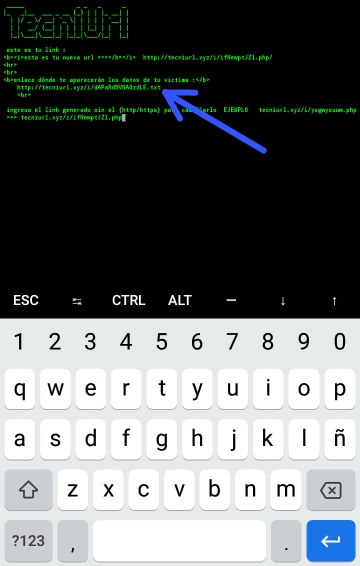
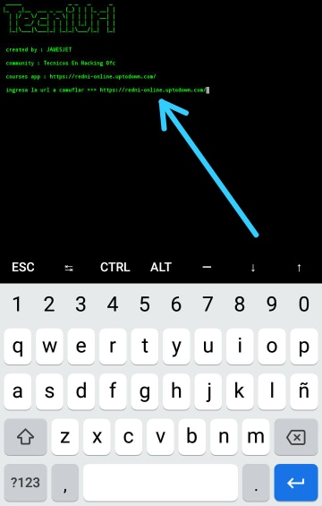
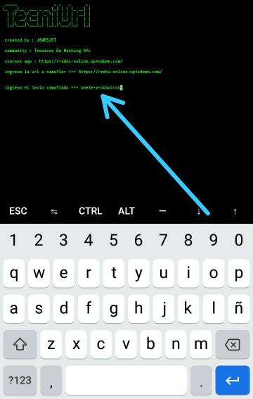
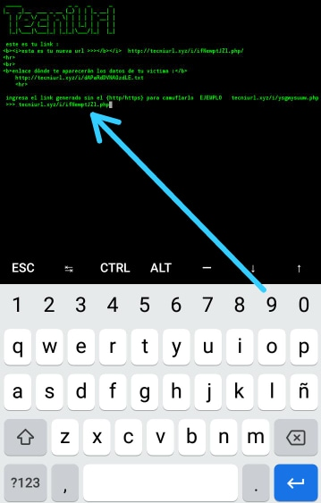

<!Doctype html>
<html>
<b>Herramienta que acorta tu enlace y crea 2 enlaces nuevos, los cuales sirven para lo siguiente</b>

<i><b>el primer link es el link acortado que le enviaras a tu victima el cual recolectara informacion de tu victima, como la IP, navegador que uso, y desde que celular entro al link</i></b>

<i><b>el segundo link es donde se guardara la informacion de tu victima, para ver la informacion de tu victima solo copea el segundo enlace y pegalo en google para que veas la informacion de tu victima</i></b>

<h1>IMAGENES DE LO QUE HABLO</h1>

<i>imagen de el link que le debes enviar a tu victima</i>

<i>imagen del link que debes abrir tu para ver la informacion de tu victima</i>

<h2>Instalacion</h2>

<ul>
<li>apt update && apt upgrade -y</li>
<li>git clone https://github.com/matrix-45-tecni/TecniUrl</li>
<li>cd TecniUrl</li>
<li>bash TecniUrl.sh</li>
</ul>

<h3>Uso</h3>

<i>ingresamos el link que vamos a acortar</i>

<i>ingresamos el nombre que le daremos para camuflar el link</i>

<i>esperamos y copeamos los 2 enlaces el que le enviaremos a la victima y el que recibira la informacion de la victima, despues pegamos el primer link sin el http, asi como lo hice yo</i>

<i>esperamos y copeamos la nueva url que nos dio, y se la enviamos  la victima, despues solo queda esperar a que entre para recibir los datos</i>

<h4>ATENCION</h4>
<b>No nos hacemos responsables del mal uso que le den a la herramienta, esto esta hecho con fines educativos he informativos, si haces algo ilegal usando esta herramienta, tu daras la cara a las autoridades, nosotros quedamos libre y limpios de todo.</b>
</html>
